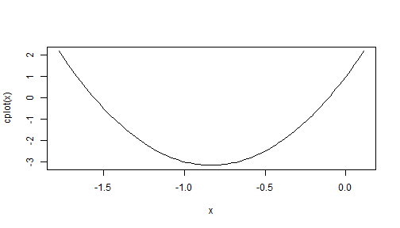
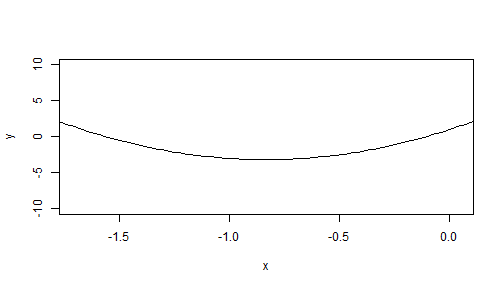

## About the tool

- This tool computes the intercepts of a quadratic curve and the x-axis and makes a plot of the area near the intercepts.
- Three inputs are required
  - x^2 term
  - x term
  - constant
- Results may not be available where the roots are not real


---

## Behind the scenes 1
- Calculates x1 and x2 using $$\frac{-b \pm \sqrt{b^2 - 4 a c}}{2a}$$
- e.g. for 6x^2 -10x + 3


```r
a<-6
b<-10
c<-1
x1 <- (-(b)+(b^2-4*a*c)^0.5)/(2*a)
x2 <- (-(b)-(b^2-4*a*c)^0.5)/(2*a)
```


--- 

## Behind the scenes 2


```r
x1
```

```
## [1] -0.1068502
```

```r
x2
```

```
## [1] -1.559816
```

Where x1 and x2 are not real, the value "no real root" will be returned.


---

## Behind the scenes 3

Additional Feature:
- Plots the curve of the line wth dynamic x-range


```r
    xlim1<-if(x1>=x2) x1 else x2
    xlim2<-if(x1>=x2) x2 else x1
cplot<-function(x) (a*x^2+b*x+c)
    plot(curve(cplot,xlim=c(xlim2-abs((xlim2-xlim1)*0.15),xlim1+abs((xlim2-xlim1)*0.15))),type="l",xlim=c(xlim2-abs((xlim2-xlim1)*0.1),xlim1+abs((xlim2-xlim1)*0.1)),ylim=c(-10,10),ylab="y",xlab="x")
```

  

---

## Target Audience

Useful for:
- People who forgot how to derive the intercepts
  - Parents checking homework
  - Students
- People who are extremely bored

